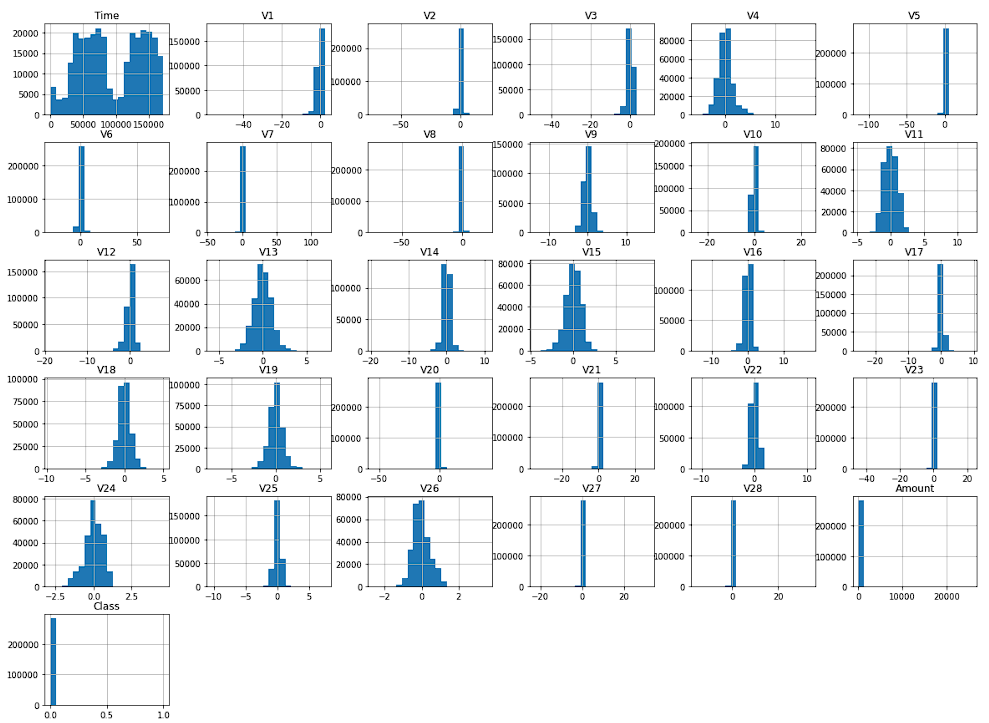
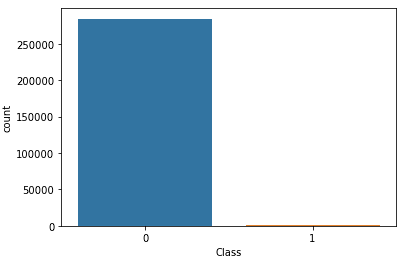
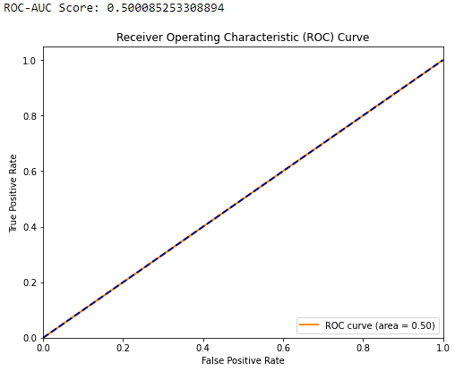

# Keras-Tensorflow

## Chapter 1: Introduction

Welcome to the "Credit Card Fraud Detection with Keras and TensorFlow" project! In this comprehensive guide, we will walk you through the process of building a powerful machine learning model for detecting fraudulent credit card transactions using state-of-the-art tools and techniques. This project not only showcases the practical application of deep learning but also emphasizes the importance of robust fraud detection systems in today's financial landscape.

### Project Overview

The primary objective of this project is to create a robust and accurate credit card fraud detection model. Credit card fraud is a prevalent issue that affects both financial institutions and consumers. It involves unauthorized transactions and can lead to substantial financial losses. Therefore, building an effective fraud detection system is crucial for maintaining the security and trust of financial services.

**In this project, we will cover the following key aspects:**

**- Loading and exploring the credit card fraud dataset.** \
**- Preprocessing the data for machine learning.** \
**- Building a deep learning model using Keras and TensorFlow.** \
**- Training and evaluating the model's performance.** \
**- Utilizing various evaluation metrics and techniques to assess the model's effectiveness.** \
**- Saving the trained model for future use.** 

By the end of this guide, you will have a well-rounded understanding of how to approach a classification problem like credit card fraud detection and build a powerful model to address it.

## Chapter 2: Data Exploration and Understanding

### The Dataset

Before diving into the technical details, it's essential to understand the dataset we'll be working with. The credit card fraud dataset contains a vast amount of transaction data, both legitimate and fraudulent. Each transaction record includes various features, such as transaction amount, time, and anonymized features. The target variable, 'Class,' indicates whether a transaction is legitimate (Class 0) or fraudulent (Class 1).

### Exploratory Data Analysis (EDA)

Exploratory Data Analysis is a crucial step in any data science project. In this chapter, we examine the dataset's characteristics and distribution. We visualize the data using histograms, bar plots, and other graphical tools to gain insights into the data's structure. Exploring the class distribution is especially important in an imbalanced dataset like this one.

## Chapter 3: Data Preprocessing

### Preparing the Data

Data preprocessing is a critical step in machine learning. Here, we prepare the data for training our model. We split the dataset into training and testing sets to evaluate the model's performance accurately. Additionally, we apply label encoding to convert the 'Class' variable into a numeric format suitable for machine learning.

## Chapter 4: Building the Deep Learning Model

### The Neural Network Architecture

This chapter introduces the heart of our project: the neural network architecture. We use Keras, a high-level deep learning library, to define and build our model. The neural network consists of input layers, hidden layers with activation functions, and an output layer with a sigmoid activation function for binary classification.

### Model Compilation

In this section, we compile our model, specifying the optimizer and loss function. We also include metrics like accuracy to evaluate the model during training.

## Chapter 5: Training and Model Evaluation

### Model Training

Now, we feed our prepared data into the model for training. We monitor the training process, observing how the loss and accuracy evolve over time.

### Model Evaluation

After training, we evaluate the model's performance on the test dataset. We calculate metrics such as accuracy, but we don't stop there. We delve deeper into model evaluation with the ROC-AUC score and the ROC curve. These metrics help us understand the model's ability to distinguish between fraudulent and legitimate transactions.

### Confusion Matrix and Classification Report

A detailed analysis is provided with the confusion matrix and classification report. These metrics reveal not only how many predictions were correct but also the nature of errors (false positives and false negatives). Understanding these aspects is crucial in real-world fraud detection systems.

| Confusion matrix | Class 0 | Class 1 |
| --- | --- | --- |
| Class 0 | 93838 | 0 |
| Class 1 | 149 | 0 |

Classification Report: 
| --- | precision | recall | f1-score  | support |
| --- | --- | --- | --- | --- |
| 0 | 1.00 | 1.00 | 1.00 | 93838 |
| 1 | 0.00 | 0.00 | 0.00 | 149 |
| accuracy |  |  | 1.00 | 93987 |
| macro avg | 0.50 | 0.50 | 0.50 | 93987 |
| weighted avg | 1.00 | 1.00 | 1.00 | 93987 |

## Chapter 6: Model Saving and Future Use

### Saving the Model

In this final chapter, we save our trained model to a file. This step is essential for deploying the model in production environments. With the model saved, it can be loaded and used for real-time credit card fraud detection.

## Conclusion

In conclusion, this project provides a comprehensive guide to building an effective credit card fraud detection model using Keras and TensorFlow. We've covered every step of the process, from data exploration and preprocessing to model building, training, evaluation, and deployment.

Fraud detection is a critical application in finance and beyond, and the skills learned in this project can be applied to a wide range of classification problems. Armed with this knowledge, you are well-prepared to tackle real-world challenges in the field of machine learning and data science.

We hope you find this project not only educational but also empowering. Feel free to adapt and extend the techniques demonstrated here to solve similar problems and make a positive impact in your domain.
